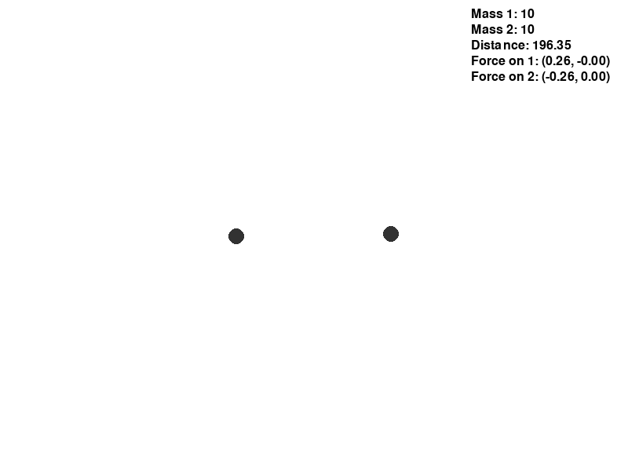
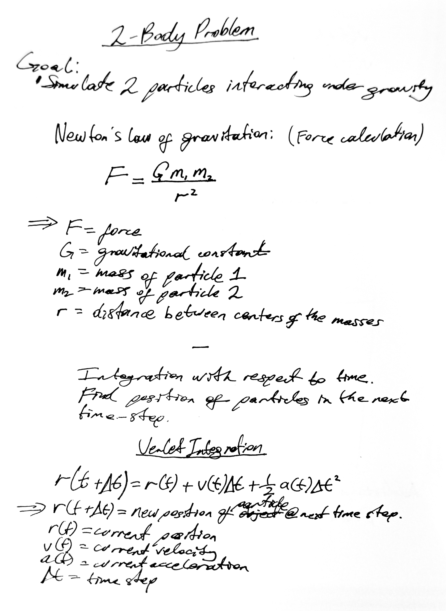
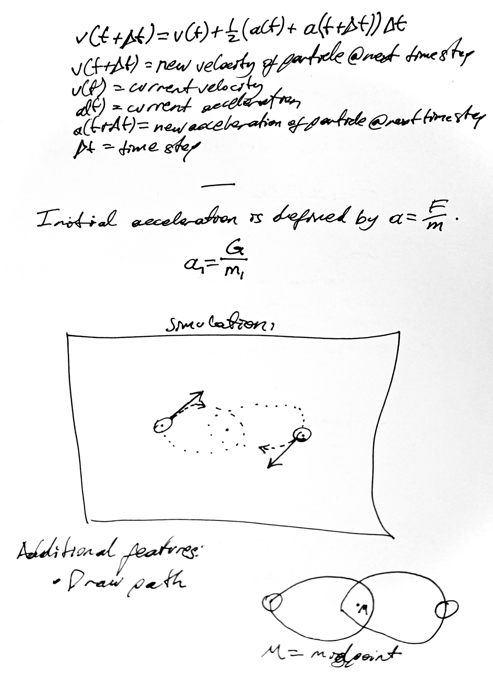

# project1_2bodyproblem

For the first project I wanted to do something simple. I figured that a precursor to the 3-body problem would suffice. This simple simulation uses [Pygame](https://www.pygame.org/news) - to visualise the simulation - and [NumPy](https://numpy.org/) - to calculate the movements of the particles.

## Table of Contents

- [Demo](#demo)
- [Code Overview](#code-overview)
- [Contact](#contact)

## Demo

*Figure: Two particles in orbit.*

## Maths overview

## Contact

**Alex Surnin**  

- **Instagram:** [insta](instagram.com)
- **Website:** Coming soon...
Feel free to reach out for collaborations, questions, or just to connect!